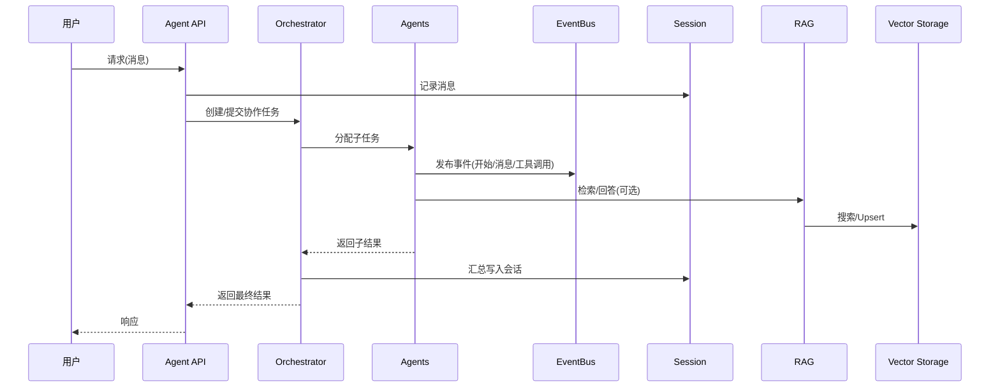

# LumosAI 架构与代码质量评估报告

> 版本：v0.2.0（根目录与简化 API 模块审查）
> 目标：提供架构设计评估、代码质量检查、安全性审查、可扩展性分析，并交付标准化技术文档、架构图、质量改进路线图与关键问题解决方案。

## 总览
- LumosAI 是一个企业级 Rust AI 框架，提供 RAG、Agent、多 Agent 协作编排、事件驱动架构与会话持久化等能力。
- 根模块提供简化 API（`agent.rs`, `orchestration.rs`, `events.rs`, `session.rs`, `rag.rs`, `vector.rs`, `prelude.rs`），通过 `lib.rs` 进行聚合导出。
- 工作区 `Cargo.toml` 管理多包与特性门控；CI 包含测试、质量、构建、安全审计、覆盖率（tarpaulin）、Docker 构建与依赖检查。

## 架构图（Mermaid）

```mermaid
flowchart TB
  subgraph API[简化 API 层]
    AG[Agent API]
    OR[Orchestration API]
    EV[Event API]
    SE[Session API]
    RG[RAG API]
    VS[Vector API]
  end

  subgraph CORE[核心实现层]
    ACore[AgentTrait & SimpleAgentImpl]
    OCore[AgentOrchestrator & CollaborationTask]
    ECore[EventBus & Handlers]
    SCore[SessionManager & Storage]
    RCore[RagTrait & SimpleRagImpl]
    VCore[VectorStorage(enum) -> Postgres/Qdrant/Weaviate/Memory]
  end

  subgraph INFRA[基础设施]
    DB[(PostgreSQL/pgvector)]
    QD[(Qdrant)]
    WV[(Weaviate)]
    RD[(Redis)]
  end

  AG --> ACore
  OR --> OCore
  EV --> ECore
  SE --> SCore
  RG --> RCore
  VS --> VCore

  RCore --> VCore
  SCore --> RD
  VCore --> DB
  VCore --> QD
  VCore --> WV

  OCore --> ECore
  ACore --> ECore
  ACore --> SCore
  OCore --> ACore
```

## 核心流程图（Mermaid）



## 模块功能与接口

- `agent.rs`
  - 类型：`AgentTrait`, `SimpleAgent`, `AgentBuilder`, `AgentResponse`
  - 能力：创建简单/自动 Agent，配置模型、提示词、温度；`call` 处理消息并返回响应。
  - 设计：Builder 模式，面向接口（Trait）抽象；与事件、会话集成点留白待扩展。

- `orchestration.rs`
  - 类型：`CollaborationTask`, `TaskBuilder`, `AgentOrchestrator`, `OrchestrationResult`
  - 能力：构建任务（名称、描述、输入、参与 Agent、超时）、顺序/并行编排，执行并聚合结果。
  - 设计：策略枚举（顺序/并行）+ Builder；与事件总线弱耦合。

- `events.rs`
  - 类型：`EventBus`, `EventHandler`, `SimpleEvent`（agent_started/…/custom）
  - 能力：发布/订阅、日志与指标处理器注册、历史查询与过滤器（agent_id/type/time）。
  - 设计：事件驱动，解耦跨模块通信；目前事件载荷为 `serde_json::Value`，建议演进为类型安全事件。

- `session.rs`
  - 类型：`Session`, `SessionBuilder`, `SessionManager` 与存储接口抽象
  - 能力：设置标题、添加/获取消息、状态管理、保存与加载用户会话。
  - 设计：Builder + Trait 抽象，可挂接不同存储（内存/Redis/数据库）。

- `rag.rs`
  - 类型：`RagTrait`, `RagSystem`, `RagBuilder`, `Document`, `SearchResult`
  - 能力：添加/删除文档、检索、回答；简化实现为内存策略，可与 `VectorStorage` 对接。
  - 设计：策略注入（embedding/provider/chunking/retrieval），便于扩展。

- `vector.rs`
  - 类型：`VectorStorage`(enum) + Builder；实现 `lumosai_vector_core::VectorStorage` Trait
  - 能力：索引创建/删除/列出/描述，文档 upsert/search/update/delete/retrieve，健康检查；后端：Postgres、Qdrant、Weaviate、Memory（特性门控）。
  - 设计：后端分发 + Builder；支持 `auto()` 依据环境变量选择后端。

- `prelude.rs` / `lib.rs`
  - 聚合导出常用类型与函数，提升开发体验；`lib.rs` 提供示例与模块说明。

## 架构设计评估
- 模块划分清晰：API 层与核心实现层分离，事件/会话/RAG/向量独立。
- 依赖关系合理：`rag` 依赖 `vector`，`agent`/`orchestration` 经 `events` 解耦。
- 设计模式应用：Builder、Trait、策略枚举、事件驱动；整体可扩展性良好。
- 改进建议：
  - 事件载荷类型安全化（定义 `Event<T>` 泛型或枚举结构体）。
  - 引入统一 `AppConfig` 与 `LumosApp` 启动器，集中初始化与依赖注入。
  - 为编排与会话增加事务边界与失败补偿策略（如 Saga-ish）。

## 代码质量检查
- 可读性：简化 API 注释到位；测试覆盖基本构建与连接性，但断言弱。
- 可维护性：Builder 与 Trait 抽象清晰；建议在核心路径增加错误上下文与结构化日志。
- 性能优化点：
  - 向量后端调用增加批量与重试策略（Builder 已有 `batch_size`）。
  - 事件处理器异步队列大小与背压策略可配置。
  - Session 存储增加读写分离与 TTL 策略（对 Redis）。

## 安全性审查
- 输入验证：`validator` 依赖已引入，但在简化 API 层未见系统性使用。建议在公共 DTO 与 API 入口统一校验。
- 权限控制：根模块未见访问控制；如暴露 HTTP 服务，应加入 JWT/角色/作用域校验（`axum-extra` 可用）。
- 敏感数据处理：
  - `.env` 与 `docker-compose` 中的 `JWT_SECRET` 默认值仅限开发；生产应由密钥管理（KMS/Secrets Manager）下发。
  - LLM API Key 使用 `env` 注入需避免日志泄露；统一通过 `Config` 读取并在日志中打码。
- 依赖安全：CI 已运行 `cargo-audit`；建议补充 `cargo-deny`（许可、来源、漏洞策略）与 SBOM 生成。

## 可扩展性分析
- 接口设计：Trait + Builder 便于扩展，`auto()` 的后端选择提升易用性。
- 插件机制：可围绕事件总线与编排器引入工具插件（Tool Trait），提升工具调用能力。
- 配置灵活性：建议集中化 `AppConfig`（YAML/ENV/CLI 合并）并提供 `ConfigBuilder`。

## 根目录构建与配置问题（发现与建议）
- `docker-compose.yml`：`WEAVIATE_URL` 之前指向宿主 8081（端口映射），在容器网络中应使用容器内部 `8080`。已修复为 `http://weaviate:8080`。
- `Cargo.toml`：工作区依赖包含 UI 相关（`dioxus` 等），建议迁移到具体 UI 子包，避免根构建负担。
- 特性门控：默认仅启用内存向量后端；建议增加 `vector-auto` 汇总特性并在文档中明确生产后端选择策略。
- CI 覆盖率：Linux 上使用 tarpaulin；Mac 本地建议 `cargo-llvm-cov` 以便开发者查看。

## 项目初始化流程（优化建议）
- 建议新增 `LumosApp` 启动器：统一加载配置、初始化向量/RAG/事件/会话、注册编排器与路由。

```rust
/// Lumos 应用启动器（示例伪代码）
pub struct LumosApp {
    /// 全局配置
    config: AppConfig,
    /// 事件总线
    event_bus: EventBus,
    /// 向量存储
    vector: VectorStorage,
    /// RAG 系统
    rag: RagSystem,
    /// 会话管理
    session: SessionManager,
    /// 编排器
    orchestrator: AgentOrchestrator,
}

impl LumosApp {
    /// 从环境与文件加载配置，完成所有依赖初始化
    pub async fn bootstrap() -> Result<Self> { /* ... */ }
    /// 启动 HTTP 服务或 CLI 入口
    pub async fn serve(self) -> Result<()> { /* ... */ }
}
```

## 跨模块通信机制评估
- 事件驱动实现良好，支持日志与指标处理器；建议：
  - 定义类型安全事件（避免 `serde_json::Value` 任意结构）。
  - 引入事件版本与模式约束（Schema Registry）以保障演进。
  - 为关键路径事件添加可靠投递与重试策略。

## 自动化测试覆盖率（方案与模板）
- CI（Linux）：`cargo tarpaulin --out Xml --workspace` 生成 `cobertura.xml`，上传至 Codecov。
- 本地（Mac）：
  - 安装：`cargo install cargo-llvm-cov`，如需 LLVM：`brew install llvm`。
  - 运行：`cargo llvm-cov --workspace --html --open` 或 `--summary-only`。
- 报告模板（示例 Markdown）：
  - 统计：语句覆盖、分支覆盖、按包/模块细分。
  - 阈值：建议设定最低 80%，低于阈值时 CI 标黄色并提示。

## 代码规范（现状与改进）
- 现状：已使用 `rustfmt` 与 `clippy -D warnings`；建议：
  - 增加 `rustfmt.toml`（例如统一 `max_width=100`, `use_small_heuristics=Off`）。
  - 增加 `clippy.toml` 自定义允许/禁止规则；强制 `missing_docs` 在公共 API。
  - 在核心函数添加函数级文档注释，使用 `///` 说明输入/输出与副作用。

## 技术债务清单（含优先级）
- P0（立即处理）
  - 修复容器网络端口与服务健康检查一致性（Weaviate URL 已修复）。
  - 敏感配置集中管理（JWT/LLM Keys），移除默认弱密钥。
  - 事件载荷类型安全化的设计方案落地（最小可用集）。
- P1（近期迭代）
  - 引入 `cargo-deny` 与 SBOM；CI 门禁依赖漏洞与许可。
  - `LumosApp` 启动器与统一 `AppConfig`；文档与样例完善。
  - 增强测试：核心路径断言与错误场景覆盖；编排并行与失败回退测试。
- P2（中期优化）
  - 向量后端性能优化（批处理、连接池、重试退避）。
  - 事件处理器指标标准化（Prometheus/OpenTelemetry）。
  - 会话存储 TTL、分页与检索能力增强。

## 质量改进路线图（Roadmap）
- 里程碑 M0：安全与配置硬化
  - 完成端口与 URL 修复，集中密钥管理，加入 `cargo-deny` 与 SBOM。
- 里程碑 M1：启动器与类型安全事件
  - 发布 `LumosApp` 与 `AppConfig`；落地事件类型与版本治理。
- 里程碑 M2：测试与覆盖率提升
  - 引入更强断言与失败路径测试；覆盖率阈值与趋势跟踪。
- 里程碑 M3：性能与可观测性
  - 向量后端性能优化；OpenTelemetry 接入与指标告警。

## 关键问题解决方案提案
- 构建配置问题
  - 方案：拆分 UI 依赖到子包，根包仅引入必要依赖；统一特性门控（`vector-auto`）。
  - 效果：减少构建体积与时间，避免无关依赖破坏根包编译稳定性。
- 初始化流程优化
  - 方案：`LumosApp` 统一初始化，支持 CLI/HTTP 双入口；集中依赖注入。
  - 效果：提升可维护性与可测试性（可 Mock 依赖）。
- 核心逻辑抽象
  - 方案：细化 `AgentTrait` 与 `Tool` 接口，明确消息/工具调用的生命周期与事件。
  - 效果：实现可插拔工具生态与更清晰的编排语义。
- 跨模块通信
  - 方案：事件结构体化 + Schema Registry；引入可靠事件通道与重试退避。
  - 效果：增强鲁棒性与演进可控性。

## CI/CD 建议
- 并发控制：为 CI 各 Job 添加 `concurrency`，取消过时运行以节省资源。
- 覆盖率门禁：主分支合并要求覆盖率不低于阈值（非阻塞，提供提示）。
- 版本发布：使用 `release.yml` 产出多平台二进制；建议增加签名与供应链验证（sigstore）。
- Docker：维持多阶段构建；建议为 `serve` 健康检查路由加集成测试。

## 附：运行与验证
- 单元测试：`cargo test --workspace --lib --bins`
- 覆盖率（Mac 本地）：`cargo llvm-cov --workspace --html --open`
- Docker 本地：`docker compose up -d`（修复后 Weaviate URL 生效）

---

如需进一步落地实施，我将按路线图分批提交 PR（安全硬化 → 启动器 → 测试增强 → 可观测性）。